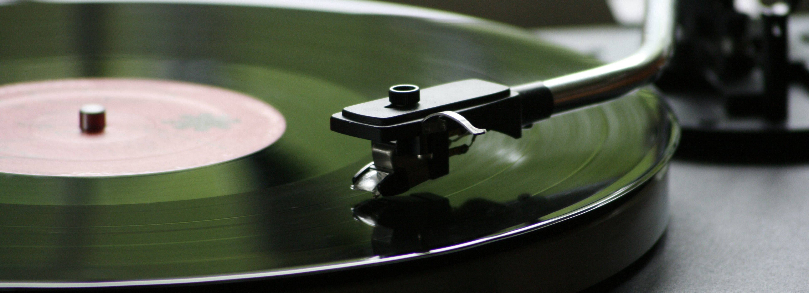

# Songs-Recommender
Recommendation System written in Python, using the pySpark framework and other Data Science libraries

## Project overview
### What is the project for
The goal of this demo is to build a recommender system able to suggest song artists to users. Given the artists and the user behaviours datasets, the first step is to analyze them and clean the data (for example: several artist names could refer to the same person or band).

Then, the model is built. The idea is to find "similar" users, so that the system can suggest new artists according to these similarities. In other words: if user "A" likes artist "X", a similar user "B" could like "X" too.

### How to access the project files
You can find both the original Python Notebook code and an HTML file, that is more portable in terms of readability.

## Technical details
### Apache Spark
The adopted framework is Spark: in particular, we have used the Spark-SQL and Spark-MLLib modules to access several specific functionalities.

### Data Science Python libraries
We have decided to use some of the most famous available Python libraries:
- Pandas and Numpy: data processing and analysis
- Matplotlib and Seaborn: data visualization

### The mathematical model
According to the collaborative-filtering approach, the adopted training technique is ALS (Alternating Least Squares)

## Special thanks
We want to thank you our teacher, <a href="https://github.com/michiard">Michiardi Pietro</a>, who has realized the baseline for the notebook and has guided us during its realization, teaching us all the techniques presented here.

## Credits
ANGIUS Marco and AVALLE Giorgio - Ⓒ2018
